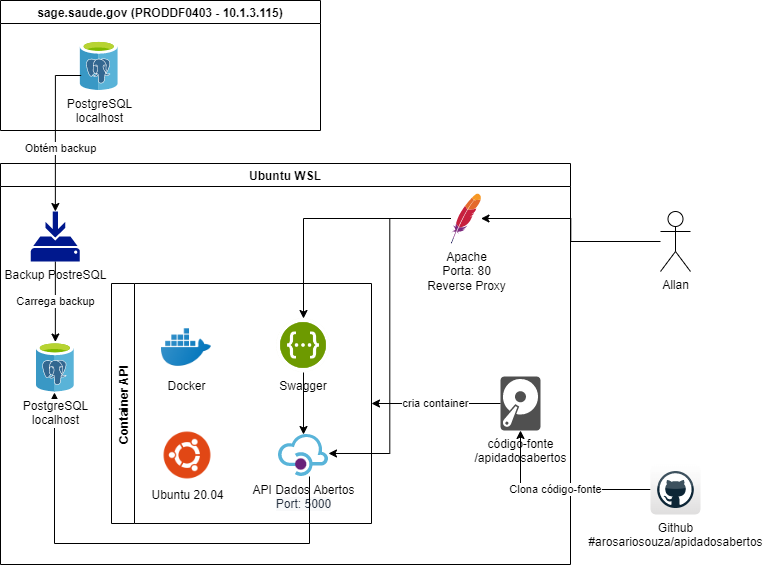
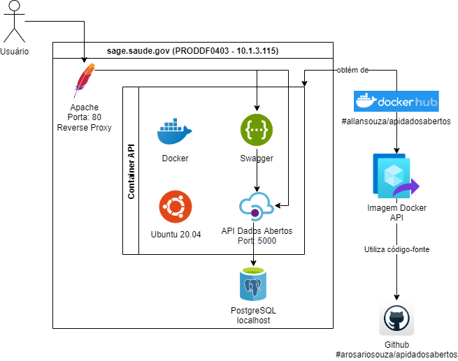
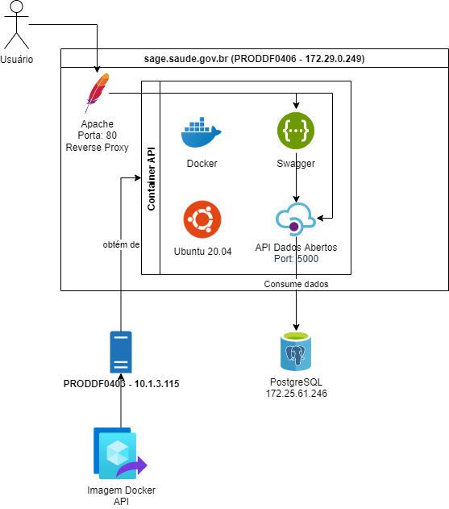

# API Dados Abertos

Documentação de instalação e manutenção do projeto.

## Índice
1. [Arquitetura](#1-arquitetura);
2. [Preparação de ambiente de desenvolvimento](#2-preparação-e-manutenção-do-ambiente-de-desenvolvimento);
    - [2.01. Instalação do Ubuntu no WSL2](#201-instalação-do-ubuntu-no-wsl2);
    - [2.02. Instalação do Visual Studio Code](#202-instalação-do-visual-studio-code);
    - [2.03. Instalação do Docker Desktop no Ubuntu WSL2](#203-instalação-do-docker-desktop-no-ubuntu-wsl2);
    - [2.04. Instalação do Docker Compose no Ubuntu WSL2](#204-instalação-do-docker-compose-no-ubuntu-wsl2);
    - [2.05. Instalação do git no Ubuntu WSL2](#205-instalação-do-git-no-ubuntu-wsl2);
    - [2.06. Obtenção do código-fonte](#206-obtenção-do-código-fonte);
    - [2.07. Preparação do ambiente python](#207-preparação-do-ambiente-python);
    - [2.08. Arquivos e diretórios do projeto](#208-arquivos-e-diretórios-do-projeto);
    - [2.09. Criação de views na base de dados](#209-criação-de-views-na-base-de-dados);
    - [2.10. Criação de variáveis de ambiente em desenvolvimento](#210-criação-de-variáveis-de-ambiente-em-desenvolvimento);
    - [2.11. Execução do projeto a partir do código-fonte](#211-execução-do-projeto-a-partir-do-código-fonte);
    - [2.12. Criando imagem Docker do projeto](#212-criando-imagem-docker-do-projeto);
    - [2.13. Criação de variáveis de ambiente para container Docker em desenvolvimento](#213-criação-de-variáveis-de-ambiente-para-container-docker-em-desenvolvimento);
    - [2.14. Execução do projeto a partir de imagem Docker utilizando Docker Compose](#214-execução-do-projeto-a-partir-de-imagem-docker-utilizando-docker-compose);
    - [2.15. Envio de imagem docker do projeto ao Docker Hub](#215-envio-de-imagem-docker-do-projeto-ao-docker-hub);
    - [2.16. Configuração do swagger](#216-configuração-do-swagger);
    - [2.17. Customização de home page do swagger](#217-customização-de-home-page-do-swagger);
3. [Disponilização de nova versão de homologação](#3-disponilização-de-nova-versão-de-homologação);
    - [3.01. Instalação do Docker no servidor de homologação Ubuntu](#);
    - [3.02. Instalação do Docker Compose no servidor de homologação Ubuntu](#);
    - [3.03. Obtenção de imagem docker do projeto a partir do Docker Hub](#);
    - [3.04. Execução do projeto a partir de imagem Docker utilizando Docker Compose](#);
4. [Disponilização de nova versão de produção](#4-disponilização-de-nova-versão-de-produção).
    - [4.01. Instalação do Docker no servidor de homologação Ubuntu](#)
    - [4.02. Instalação do Docker Compose no servidor de homologação Ubuntu](#)
    - [4.03. Envio de arquivo de imagem Docker do projeto em homologação para ambiente de produção](#)
    - [4.04. Instalação de arquivo de imagem Docker do projeto no ambiente de produção](#)

## 1. Arquitetura
* ### Ambiente de Desenvolvimento
    

* ### Ambiente de Homologação
    

* ### Ambiente de Produção
    

## 2. Preparação e manutenção do ambiente de desenvolvimento
* ### 2.01. Instalação do Ubuntu no WSL2
* ### 2.02. Instalação do Visual Studio Code
* ### 2.03. Instalação do Docker Desktop no Ubuntu WSL2
* ### 2.04. Instalação do Docker Compose no Ubuntu WSL2
* ### 2.05. Instalação do git no Ubuntu WSL2
* ### 2.06. Obtenção do código-fonte
* ### 2.07. Preparação do ambiente python
* ### 2.08. Arquivos e diretórios do projeto
* ### 2.09. Criação de views na base de dados
* ### 2.10. Criação de variáveis de ambiente em desenvolvimento
* ### 2.11. Execução do projeto a partir do código-fonte
* ### 2.12. Criando imagem Docker do projeto
* ### 2.13. Criação de variáveis de ambiente para container Docker em desenvolvimento
* ### 2.14. Execução do projeto a partir de imagem Docker utilizando Docker Compose
* ### 2.15. Envio de imagem docker do projeto ao Docker Hub
* ### 2.16. Configuração do swagger
* ### 2.17. Customização de home page do swagger
## 3. Disponilização de nova versão de homologação
* ### 3.01. Instalação do Docker no servidor de homologação Ubuntu
* ### 3.02. Instalação do Docker Compose no servidor de homologação Ubuntu
* ### 3.03. Obtenção de imagem docker do projeto a partir do Docker Hub
* ### 3.04. Execução do projeto a partir de imagem Docker utilizando Docker Compose
## 4. Disponilização de nova versão de produção
* ### 4.01. Instalação do Docker no servidor de homologação Ubuntu
* ### 4.02. Instalação do Docker Compose no servidor de homologação Ubuntu
* ### 4.03. Envio de arquivo de imagem Docker do projeto em homologação para ambiente de produção
* ### 4.04. Instalação de arquivo de imagem Docker do projeto no ambiente de produção

**Desenvolvedor**: Allan Souza <allan.carloss@gmail.com>